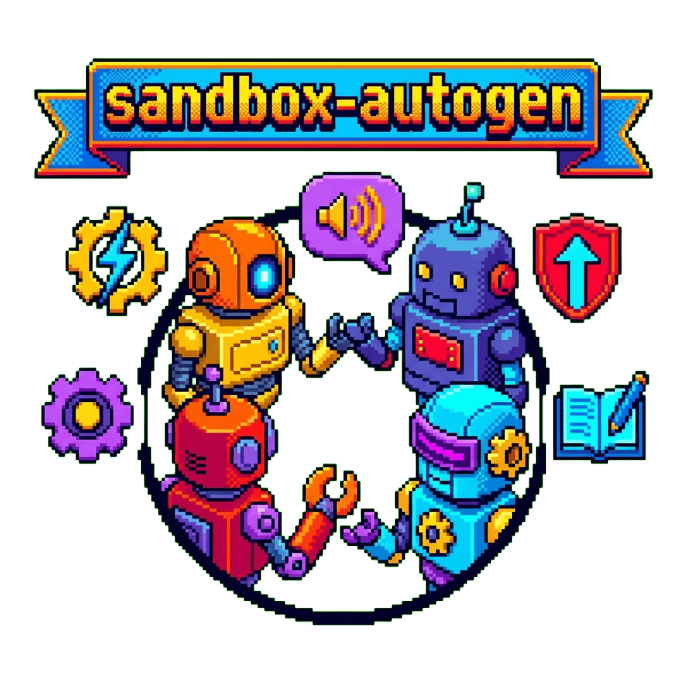

<div align="center">
  

  **🤖 Sandbox for experimenting with Microsoft AutoGen multi-agent framework 🧪**

</div>

## Overview

A sandbox environment for experimenting with Microsoft AutoGen - a framework for building LLM applications using multiple agents that converse to solve tasks.

## Features

- **Multi-agent conversations** - Agents collaborate to solve tasks
- **Web surfing agent** - Browse the web with MultimodalWebSurfer
- **Team orchestration** - RoundRobinGroupChat for turn management
- **Async API** - Modern async/await patterns

## Quick Start

```bash
# Clone and setup
git clone https://github.com/tsilva/sandbox-autogen.git
cd sandbox-autogen

# Create environment
conda env create -f environment.yml
conda activate autogen-sandbox

# Configure API key
cp .env.example .env
# Edit .env with your OPENAI_API_KEY

# Run an example
python single.py
```

## Examples

| Script | Description |
|--------|-------------|
| `single.py` | Simple single agent with async API |
| `team.py` | Multi-agent team with web surfing |
| `example.py` | Legacy API example |

## Architecture

```
Agent Types:
├── AssistantAgent      # AI-powered agent
├── UserProxyAgent      # User interaction
└── MultimodalWebSurfer # Web browsing

Orchestration:
├── RoundRobinGroupChat # Turn-taking management
└── TextMentionTermination # Graceful ending
```

## Requirements

- Python 3.10+
- Conda
- OpenAI API key
- Playwright (for web surfing)

## License

MIT
