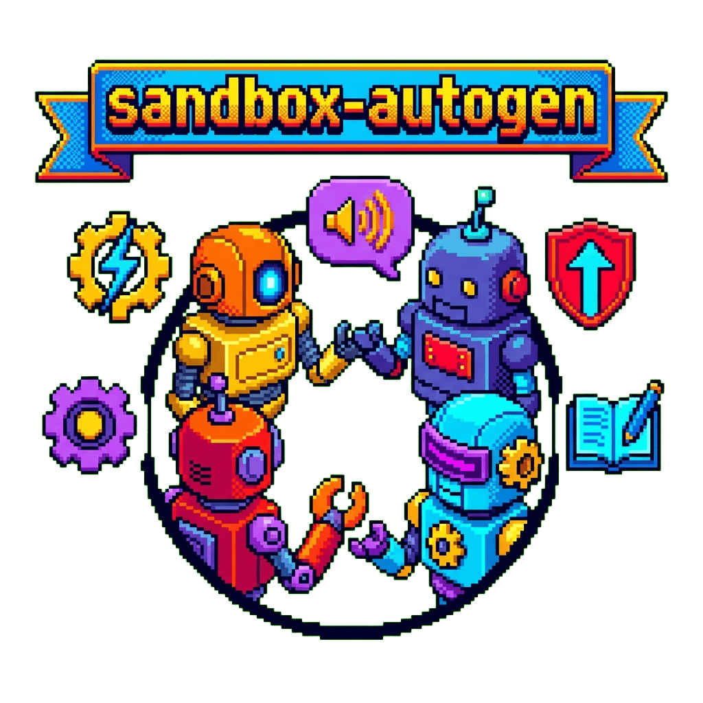
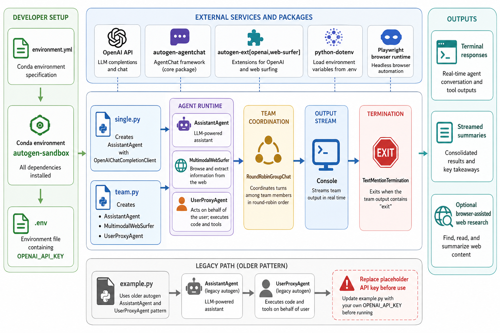

<div align="center">
  

  **🤖 Sandbox for experimenting with Microsoft AutoGen multi-agent framework 🧪**
</div>

sandbox-autogen is a small Python sandbox for trying Microsoft AutoGen agent patterns with OpenAI models. It includes a single-agent example, a multi-agent team with a web surfer, and one legacy example that shows the older synchronous API shape.

Use it to compare the modern async AutoGen APIs, wire agents to `OPENAI_API_KEY` from `.env`, and run quick terminal experiments before moving the pattern into another project.

## Install

```bash
git clone https://github.com/tsilva/sandbox-autogen.git
cd sandbox-autogen
conda env create -f environment.yml
conda activate sandbox-autogen
cp .env.example .env
playwright install
```

Add your OpenAI API key to `.env`, then run an example from the repo root:

```bash
python single.py
```

## Commands

```bash
python single.py   # run one AssistantAgent with the modern async API
python team.py     # run a RoundRobinGroupChat with web surfing and user proxy agents
```

## Notes

- The Conda environment is defined in `environment.yml` and uses Python 3.10.
- `.env.example` declares the required `OPENAI_API_KEY` variable.
- `single.py` and `team.py` load `.env` with `python-dotenv` and use `OpenAIChatCompletionClient(model="gpt-4o")`.
- `team.py` uses `MultimodalWebSurfer`, so Playwright browser binaries may need to be installed with `playwright install`.
- `example.py` is a legacy reference and still contains a placeholder API key. Prefer the modern async examples for new work.

## Architecture



## License

[MIT](LICENSE)
